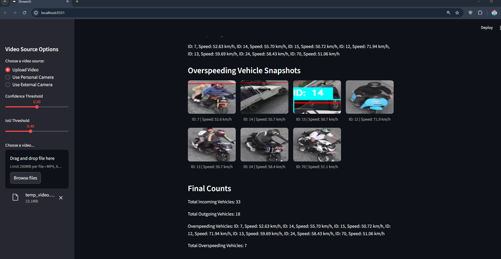
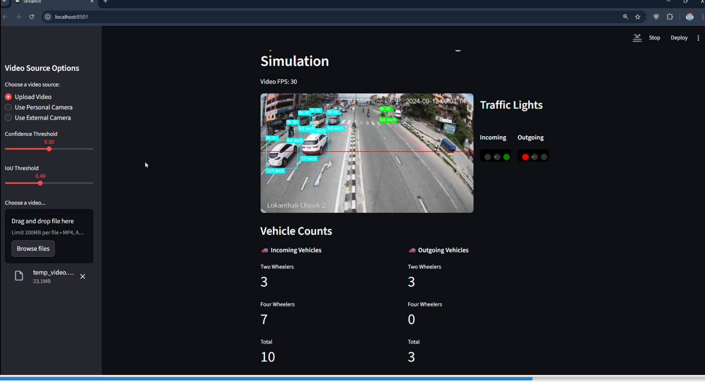

# 🚦 SmartFlow

## Real-Time Vehicle Tracking, Lane-wise Counting & Adaptive Traffic Signal Optimization

------------------------------------------------------------------------

## 📌 Project Overview

SmartFlow is an intelligent traffic monitoring system that performs:

-   🚗 Real-time vehicle detection\
-   🆔 Multi-object tracking\
-   🛣 Lane-wise vehicle counting\
-   🚦 Adaptive traffic signal time suggestion

The system leverages deep learning and computer vision to analyze
traffic congestion and dynamically recommend optimal signal durations.

------------------------------------------------------------------------

## 🎥 Demo Video

https://www.youtube.com/watch?v=0YFlV_16DUs

## 📷 Output Preview

  
  

------------------------------------------------------------------------

## 🧠 Technologies Used

-   YOLOv5 -- Real-time object detection\
-   DeepSORT -- Multi-object tracking\
-   Python\
-   PyTorch\
-   OpenCV\
-   NumPy

------------------------------------------------------------------------

## 🔍 System Architecture

Input Video / CCTV Stream\
↓\
YOLO Vehicle Detection\
↓\
DeepSORT Tracking\
↓\
Lane-wise Counting\
↓\
Traffic Signal Suggestion Logic\
↓\
Visual Output + Statistics

------------------------------------------------------------------------

## 🚗 Vehicle Detection (YOLO)

YOLO (You Only Look Once) is a single-stage object detection algorithm
capable of real-time performance.

Detected vehicle classes: - 
- Two Wheeler
- Four Wheeler

Each detection outputs: 
- Bounding box coordinates
- Confidence score
- Class label

------------------------------------------------------------------------

## 🆔 Vehicle Tracking (DeepSORT)

DeepSORT assigns a unique ID to each detected vehicle and tracks it
across frames.

It uses: - Kalman Filter for motion prediction\
- Appearance feature embeddings
- Hungarian algorithm for matching

This prevents: 
- Double counting
- ID switching
- Tracking loss during partial occlusion

------------------------------------------------------------------------

## 🛣 Lane-wise Vehicle Counting

Lane regions are predefined using coordinate boundaries.

When a tracked vehicle crosses a counting line : 
- It is counted only once\
- The count is stored per lane\
- Duplicate counting is avoided using tracking IDs

Example:

  Lane     Vehicle Count
  -------- ---------------
  Incoming  25
  Outgoing  18
  

------------------------------------------------------------------------

## 🚦 Traffic Signal Suggestion Logic

Signal timing is dynamically calculated based on vehicle density.

Green Time Formula:

Green Time = Base Time + (Vehicle Count × Scaling Factor)

If one lane has significantly higher congestion, the system increases
its green signal duration to reduce waiting time.

------------------------------------------------------------------------

## ⚙️ Installation

1️⃣ Clone Repository

git clone https://github.com/yourusername/SmartFlow.git\
cd SmartFlow

2️⃣ Create Virtual Environment

python -m venv venv\
venv`\Scripts`{=tex}`\activate  `{=tex}

3️⃣ Install Dependencies

pip install -r requirements.txt

------------------------------------------------------------------------

## ▶️ Running the Project

python -m streamlit run app.py

------------------------------------------------------------------------

## 📊 Output Features

✔ Real-time bounding boxes\
✔ Unique tracking IDs\
✔ Lane-wise vehicle count overlay\
✔ Congestion statistics\
✔ Traffic signal timing suggestion

------------------------------------------------------------------------

## 🌍 Use Cases

-   Smart City Infrastructure\
-   Traffic Control Systems\
-   Urban Planning Analysis\
-   CCTV-based Traffic Monitoring\
-   AI Research Projects

------------------------------------------------------------------------

## 🚀 Future Improvements

-   Emergency vehicle priority detection\
-   AI-based congestion prediction\
-   Web dashboard visualization\
-   Cloud-based monitoring\
-   IoT traffic signal integration

------------------------------------------------------------------------

## 📄 License

This project is for academic and educational purposes.
